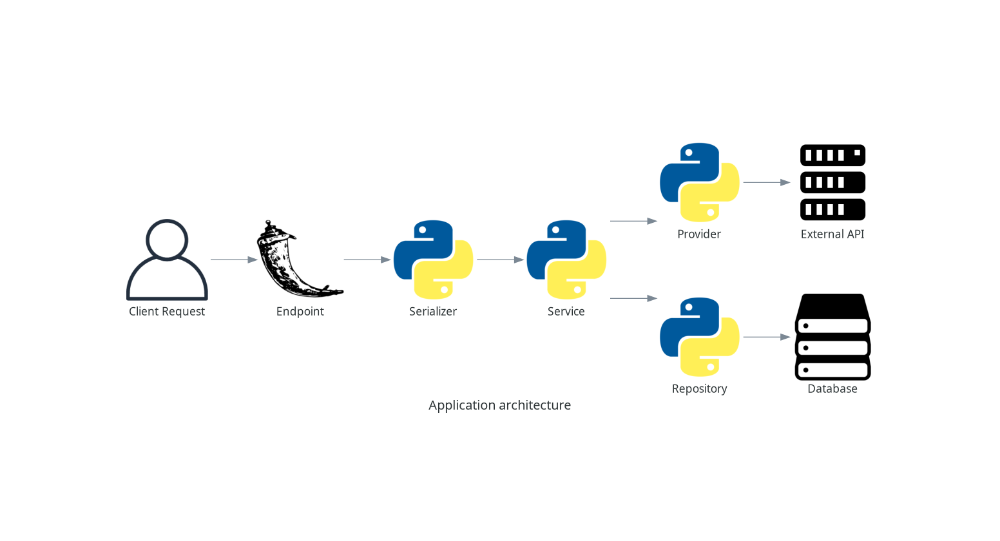

# Mock API Client

Is a small API to do requests to the public API JSONPlaceholder.

It follows DDD principles, you can see the diagram of the concepts:




- **Endpoint**: it's the entry point in the application where the client interacts with the server. It typically handles HTTP requests (e.g., GET, POST, PUT) and returns the appropriate response.
- **Serializer**: it's responsible for converting complex data types (like database models) into formats suitable for transmission (e.g., JSON) and vice versa. It validates, formats, and deserializes incoming data and serializes outgoing data.
- **Service**: it contains business logic. It is typically used to encapsulate complex operations that need to be performed in response to an endpoint request. Services often interact with repositories and providers to perform actions like creating, retrieving, updating, or deleting data.
- **Provider**: it acts as an abstraction layer that interfaces with external services or APIs. It handles communication with third-party systems, encapsulating the details of how data is retrieved or sent outside the application (e.g., calling an external API).
- **Repository**: it abstracts the data access logic, providing methods to interact with the database (e.g., fetch, save, update, or delete records). It keeps the business logic (services) decoupled from the persistence layer (database). Repositories allow for easier testing and maintainability.


---

## 🛠️ Local environment installation

To set up locally, follow these steps:

### 1. Copy `.env.example` to `.env` and `.env.test`

- Create `.env` and `.env.test` files from the provided `.env.example` and update the necessary environment variables.


### 2. Add the hostname in your hosts file, for example:

```bash
[...]
127.0.0.1 mosk-api-client.local
[...]
```

### 3. Build and run the application

Once the database is set up, proceed to build and run the application with:

```bash
cd src
flask run
```

This will start the Flask application with the appropriate database setup.


### 4. How CI/CD and deployment to AWS could be handled?

Use a CI tool like GitHub Actions, GitLab CI, CircleCI, or Jenkins to automate:

- Code Checkout: Pull the latest code from your repository.
- Dependency Installation: e.g., pip install -r requirements.txt.
- Linting & Formatting: e.g., flake8, black, isort.
- Testing: Run unit/integration tests, e.g., pytest.

---

## 📄 License

This project is licensed under the MIT License.

---

## 📢 Contributing

We welcome contributions! Feel free to submit issues, feature requests, or pull requests to improve `mock-api-client`.

---
